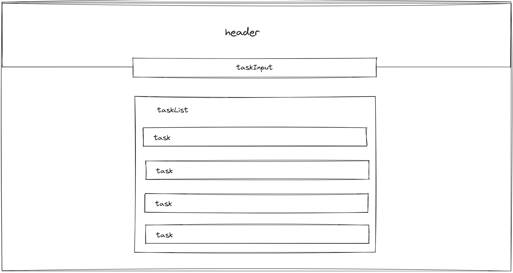
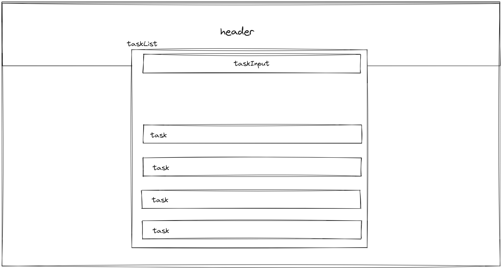
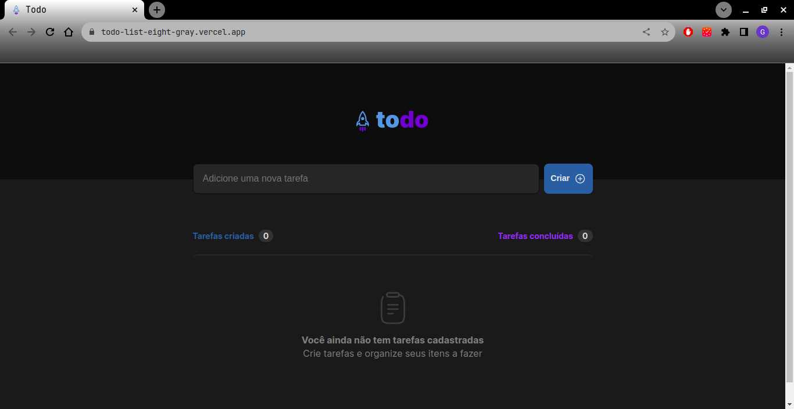
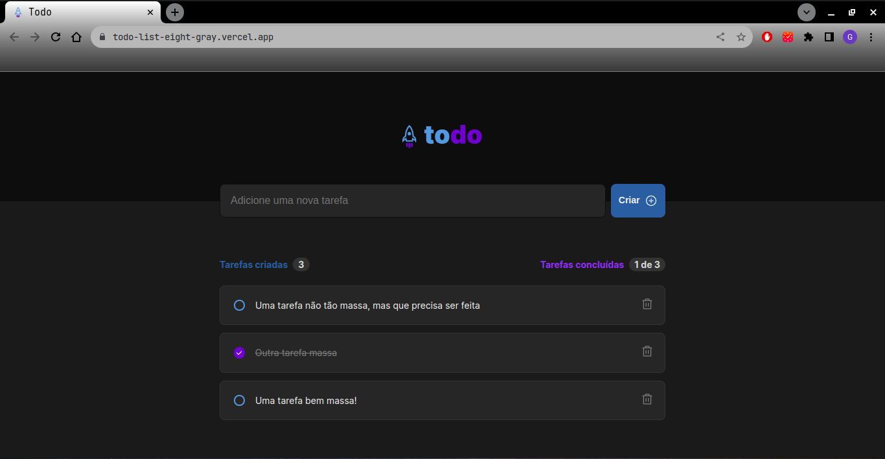
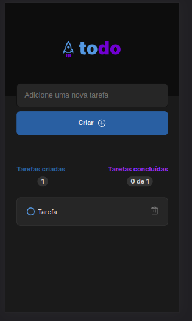

# Todo List - Ignite

Este projeto faz parte da trilha de estudos em ReactJS do curso [Ignite](https://lp.rocketseat.com.br/ignite?utm_source=google&utm_medium=cpc&utm_campaign=lead&utm_term=perpetuo&utm_content=publicofrio-lead-ignite-texto-lead-kws-none-none-ignite-metodoeficiente-none-br-sitelink&gclid=CjwKCAjwyqWkBhBMEiwAp2yUFgsMHLhkTCPzfY1Oos333T9fPW8C4TA7ZrARMJ9EM7aec3H8tk0o2hoC6lwQAvD_BwE) da Rocketseat.

---
## Descrição
A proposta deste projeto é desenvolver uma SPA (Single Page Application) que fosse capaz de receber uma lista de tarefas que podem ser gerenciadas pelo usuário tanto o status, quanto poder excluir a tarefa.

---
## Recursos utilizados

Todo o design e estilização foi fornecido pela própira Rocketset.
Além disso, os recursos de ambiente de desenvolvimento foram:
- Node versão: 16.20.0
- Npm versão: 8.19.4
- Npx versão: 8.19.4
- Linux Ubuntu: 20.04

Para criar o projeto utilizando o Vite, basta executar o comando:

``` bash
npm create vite@latest
```

Com o projeto criado, já criei o repositório no GitHub para armazenar o projeto remotamente também. Além disso, para facilitar no desenvolvimento será utilizado o [ESLint](https://eslint.org/) para formatação padrão, seguindo o padrão estabelecido pela [Rocketseat](https://www.npmjs.com/package/@rocketseat/eslint-config), para incluir esta préconfiguração on projeto basta baixar as configurações com: 

```bash
npm i -D eslint @rocketseat/eslint-config
```

Depois disso, criar um arquivo: .eslintrc.json na raiz do projeto com o seguinte conteúdo:

```json
{
  "extends": "@rocketseat/eslint-config/react"
  // "extends": "@rocketseat/eslint-config/node"
}
```

---
## Percepções (Relatos do desenvolvimento)

Como este foi meu primeiro projeto utilizando o ReactJS busquei caminhar o mais próximo possível do que foi ensinado pelo professor [Diego Fernandes](https://github.com/diego3g). Sendo assim, meu primeiro passo foi avaliar como eu poderia compor a estrutura do projeto em componentes, minha primeira proposta foi: 



Enquanto estava desenvolvendo a versão estática do projeto estava tudo caminhando muito bem, acabei incluindo mais um componente dentro do componente Task que seria responsável pelo botão select de cada tarefa. Na versão estática não tive nenhum problema com estas escolhas de componentes.

Contudo, ao iniciar a parte de interação com o usuário, comecei a me depara com problemas em relacionar os componentes.

O primeiro e mais aparente problema foi ter colocado o Componente de Input de uma nova task fora da TaskList então a variável de estado da TaskList não conseguia capturar bem o conteúdo do input, além disso, o componente que criei para representar o estado do botão select representou um problema pois centralizei o gerenciamento da lista de tasks no componente TaskList, então eu precisaria passar a função de alteração de estado do componente TaskList para o componente Task, do componente Task para o componente SelectButton, então isso começou a ficar meio esquisito. 

Daí reformulei toda a estrutura, diminui a quantidade de componentes, chegando na estrutura:



Além disso, fiz um rascunho dos componentes TaskList e Task relacinando quais as responsabilidades de cada um e uma prévia do que eu iria utilizar de variáveis de estado: 

--- 

### TaskList
Responsabilidades: 

- Gerenciar contágem de Task's criadas
- Gerenciar quantidade de Task's concluídas versus criadas
- Gerenciar lista de Task's 
- Gerenciar input de nova task

====================

Estados: 

=> \[ taskList, setTaskList \] -> este estado irá fazer o input da task digitada na lista de tasks, e também o gerenciamento do status da task.

=> \[ taskInputText, setTaskInputText\] -> este estado irá fazer gerenciar o input do usuário no elemento de input da taskList 

=> \[ totalTasks, setTotalTasks \] -> este estado irá gerenciar a renderização da quantidade total de tasks criadas

=> \[ totalDoneTasks, setTotalDoneTasks \] -> este estado irá gerenciar o total de tasks feitas versus o total de tasks criadas

---
### Task
Responsabilidades:

- Gerenciar o conteúdo da task
- Chamar o gerenciamento de estado da task que está na taskList
- Gerenciar a excluesão de tasks

===========================

Estados:

=> \[ taskStatus, setTaskStatus \] -> este estado irá gerenciar o seletor e a marcação do texto

---
Com estes recursos consegui concluir o projeto.

## Principais dificuldades e pontos de melhoria

1. Estilização e estrutura

> Notei que preciso avançar nos estudos sobre CSS e HTML pois em diversas situações eu simplesmente ia mudando as propriedades do CSS pra ver qual se adequava melhor, quando o comportamente deveria ser fazer alterações mais certeiras e conseguir identificar o motivo de algumas alterações não funcionarem devidamente. 

2. Lidar com a responsividade
> Notei que preciso compreender melhor sobre as media-queries, saber melhor como funcionam e como é seu uso ideal.
---
## Resultados

Consegui concluir o projeto na minha máquina, rodando localmente. Além disso, consegui publicar o projeto na [Vercel](https://vercel.com/), que também funcionou como esperado. 
1. Tela inicial
  


---
2. Criação de tasks e marcação como concluída



---
3. Responsividade
   


Link para acesso ao projeto:

> https://todo-list-eight-gray.vercel.app/

